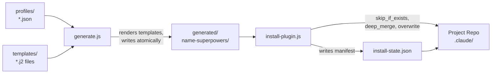
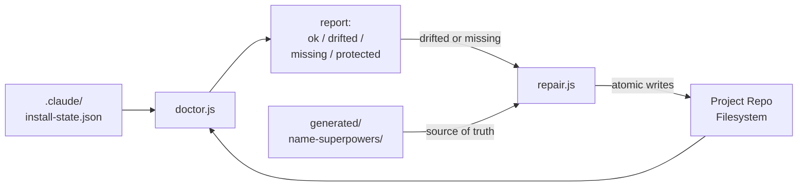

# Plugin Template Factory — Architecture

## System Overview

The plugin template factory converts a project profile (a JSON description of a tech stack) into a fully self-contained Claude Code plugin. Instead of maintaining separate plugin directories by hand for each project, you maintain one shared template and one profile per project. The factory handles the rest: variable substitution, strategy-aware file writes, idempotent installation, drift detection, and repair.

The factory serves project repos (Nuv, plus future projects) and any projects added via a new profile. Every generated plugin includes 10 specialist review agents, 4 plan review personas, knowledge files, and profile-gated hooks — all tailored to the declared stack.

---

## Data Flow

### Generation and Installation



### Conformance Detection and Repair



---

## Components

### Template Engine (`scripts/lib/template-engine.js`)

Renders `.j2` template files into final output. Supports two constructs:

- **Variable substitution:** `{{profile.stack.language}}` resolves dot-paths against the profile object. Any path that fails to resolve emits an empty string — no silent coercion, no crashes.
- **Conditional blocks:** `...` — nestable, expression-safe. The evaluator is a whitelist-based expression parser that accepts comparisons (`==`, `!=`), boolean operators (`&&`, `||`, `!`), and string/number literals. It does not use dynamic code execution primitives — arbitrary code execution is not possible.
- **Syntax validation:** Unclosed `{{` and unbalanced ``/`` pairs are caught before any output is written. Errors name the file and line number.

Non-`.j2` files in the templates directory are copied verbatim (no rendering performed).

### Plan Resolver (`scripts/lib/plan-resolver.js`)

Read-only computation step. Given a profile path and a templates directory:

1. Validates the profile against `schemas/profile.schema.json` using AJV. Missing required fields and unrecognized top-level fields both fail with explicit error messages.
2. Walks the templates directory recursively, collecting all files.
3. For each file, determines the write strategy based on the output filename (see strategy table below).
4. Renders `.j2` files through the template engine with the profile as context.
5. Returns a sorted operations array — no files are written.

No filesystem side effects occur during plan resolution. The generator calls this, inspects the plan, then executes it.

**Strategy assignment rules:**

| Output filename | Strategy |
|---|---|
| `CLAUDE.md`, `AGENTS.md` | `skip_if_exists` |
| `hooks.json`, `settings.json` | `deep_merge` |
| Everything else | `overwrite` |

### File Operations (`scripts/lib/file-operations.js`)

Three write primitives used by all commands:

| Function | Behavior |
|---|---|
| `writeFileAtomic(dest, content)` | Writes to a `.tmp` file, then renames. Prevents partial writes. Returns `created`, `updated`, or `skipped` (when content is identical to existing file). |
| `writeFileIfNotExists(dest, content)` | Writes only when the file is absent. Returns `created` or `skipped`. Never overwrites. |
| `contentHash(content)` | SHA-256 of a string. Used for drift detection and idempotency checks. |
| `fileContentHash(path)` | SHA-256 of a file on disk. |

Status values returned by file operations: `created`, `updated`, `skipped`, `protected`, `merged`, `conflicted`, `orphaned`.

### Schema Validator (`scripts/lib/schema-validator.js`)

AJV-backed validator loaded with all schemas from the `schemas/` directory. Used by:

- `plan-resolver.js` — validates the profile before any template rendering
- `generate.js` — validates the rendered `plugin.json` content against `plugin-manifest.schema.json` before any files are written
- `doctor.js` — validates its own conformance report output against `conformance-report.schema.json`

A schema validation failure prevents all downstream file writes.

### Deep Merge (`scripts/lib/deep-merge.js`)

Additive JSON merge. Source keys are added to the target; existing target keys are never removed. Arrays under hook event names in `settings.json` are unioned (deduplicated by matcher key) rather than replaced, so existing hook registrations survive an install or re-install.

### Install State (`scripts/lib/install-state.js`)

Reads and writes `.claude/install-state.json`, which records:

- `templateVersion` — version from `package.json` at generation time
- `profileHash` — SHA-256 of the profile JSON at generation time
- `operations` — array of `{ kind, source, dest, strategy, contentHash }` for every file written

The manifest is used by `doctor.js` to compare expected hashes against the current filesystem, and by `generate.js --update` to implement three-way merge conflict detection.

---

## CLI Command Reference

| Command | Description | Key flags |
|---|---|---|
| `node scripts/generate.js` | Generate a plugin from a profile | `--profile`, `--output`, `--update`, `--dry-run`, `--json` |
| `node scripts/install-plugin.js` | Install a generated plugin into a project repo | `--plugin`, `--target`, `--dry-run`, `--json` |
| `node scripts/doctor.js` | Compare installed files against install-state manifest | `--target`, `--quick`, `--json` |
| `node scripts/repair.js` | Restore drifted or missing files from generated plugin | `--target`, `--source`, `--dry-run`, `--json` |
| `node scripts/validate-schemas.js` | Validate all JSON files in the repo against declared schemas | — |

All state-mutating commands (`generate`, `install-plugin`, `repair`) support `--dry-run`. All commands support `--json` for machine-readable output.

**Exit codes:**

| Code | Meaning |
|---|---|
| 0 | Success |
| 1 | Validation error or drift detected |
| 2 | Fatal error (missing args, I/O failure, no install-state) |
| 3 | `generate --update` completed with conflicts |

---

## Design Principles

**Idempotency.** Running any command twice with the same inputs produces zero filesystem changes on the second run. `writeFileAtomic` compares SHA-256 hashes before writing; identical content results in `skipped`.

**Determinism.** Given identical profile content and template version, generation produces byte-identical output (excluding the install-state timestamp field). Two CI runs on the same commit produce the same plugin.

**Schema validation before writes.** The profile is validated before template rendering. The rendered `plugin.json` is validated before any files are written. A failure in either validation aborts the entire operation — no partial output.

**Conformance tracking.** Every file written during generation or installation is recorded in `install-state.json` with its content hash and write strategy. This enables `doctor` to detect drift and `repair` to restore it, without needing access to the original profile or template at audit time.

**`skip_if_exists` for user files.** `CLAUDE.md` and `AGENTS.md` are written once and never overwritten by subsequent installs or regenerations. Users can edit them freely. `doctor` reports them as `protected` (not `drifted`) when they have been modified.

**`deep_merge` for configs.** `settings.json` and `hooks.json` are merged additively. Existing permissions, environment variables, and hook registrations survive install and re-install. Hook arrays are deduplicated by matcher key.

**Atomic writes.** All file writes go through a write-to-temp, rename sequence. Concurrent access or process interruption cannot produce a partial file.

**No network access.** All commands are fully local. `doctor` completes in under 2 seconds for a full plugin audit.

---

## Template Structure

```
templates/
├── CLAUDE.md.j2                         # Project instructions (skip_if_exists)
├── AGENTS.md.j2                         # Codex agent declarations (skip_if_exists)
├── plugin.json.j2                       # Plugin manifest (overwrite)
├── agents/
│   ├── review/
│   │   ├── complexity-review.md.j2      # 10 specialist review agents
│   │   ├── concurrency-review.md.j2
│   │   ├── doc-review.md.j2
│   │   ├── domain-review.md.j2
│   │   ├── naming-review.md.j2
│   │   ├── performance-review.md.j2
│   │   ├── progress-guardian.md.j2
│   │   ├── spec-compliance-review.md.j2
│   │   ├── structure-review.md.j2
│   │   └── test-review.md.j2
│   └── team/
│       └── orchestrator.md.j2
├── hooks/
│   ├── hooks.json.j2                    # Hook registration manifest (deep_merge)
│   ├── dispatcher.js                    # Hook runner (verbatim copy)
│   ├── gateguard.js                     # Investigation-before-action gate (verbatim)
│   └── run-with-flags.js                # Shared hook utilities (verbatim)
├── knowledge/
│   ├── accepted-risks-schema.md         # Risk acceptance format (verbatim)
│   ├── owasp-detection.md               # OWASP reference (verbatim)
│   ├── review-rubric.md                 # Scoring rules (verbatim)
│   └── review-template.md               # Output format reference (verbatim)
└── prompts/
    ├── plan-review-acceptance.md.j2     # 4 plan review personas
    ├── plan-review-design.md.j2
    ├── plan-review-strategic.md.j2
    └── plan-review-ux.md.j2
```

Files ending in `.j2` are rendered through the template engine. All other files are copied verbatim.

---

## Generated Plugin Structure

After running `generate.js`, the output directory contains:

```
generated/<name>-superpowers/
├── CLAUDE.md                            # Project instructions (skip_if_exists on install)
├── AGENTS.md                            # Codex declarations (skip_if_exists on install)
├── plugin.json                          # Claude Code plugin manifest
├── agents/
│   ├── review/                          # 10 specialist review agents (stack-tailored)
│   └── team/
│       └── orchestrator.md              # Dispatches review agents, aggregates output
├── hooks/
│   ├── dispatcher.js                    # Executes hooks per event
│   ├── gateguard.js                     # Blocks file writes until context is read
│   ├── hooks.json                       # Hook registrations (deep_merged into settings.json)
│   └── run-with-flags.js                # Shared utilities
├── knowledge/
│   ├── accepted-risks-schema.md
│   ├── owasp-detection.md
│   ├── review-rubric.md
│   └── review-template.md
├── prompts/
│   ├── plan-review-acceptance.md        # Adversarial plan review personas
│   ├── plan-review-design.md
│   ├── plan-review-strategic.md
│   └── plan-review-ux.md
└── .claude/
    └── install-state.json               # Generation manifest (not installed into target)
```

When installed into a project, all files except `.claude/install-state.json` are copied to `<project>/.claude/`. `CLAUDE.md` and `AGENTS.md` go to the project root with `skip_if_exists`. `hooks/hooks.json` is deep-merged into `<project>/.claude/settings.json`. A new `install-state.json` is written to `<project>/.claude/install-state.json` recording the install.
