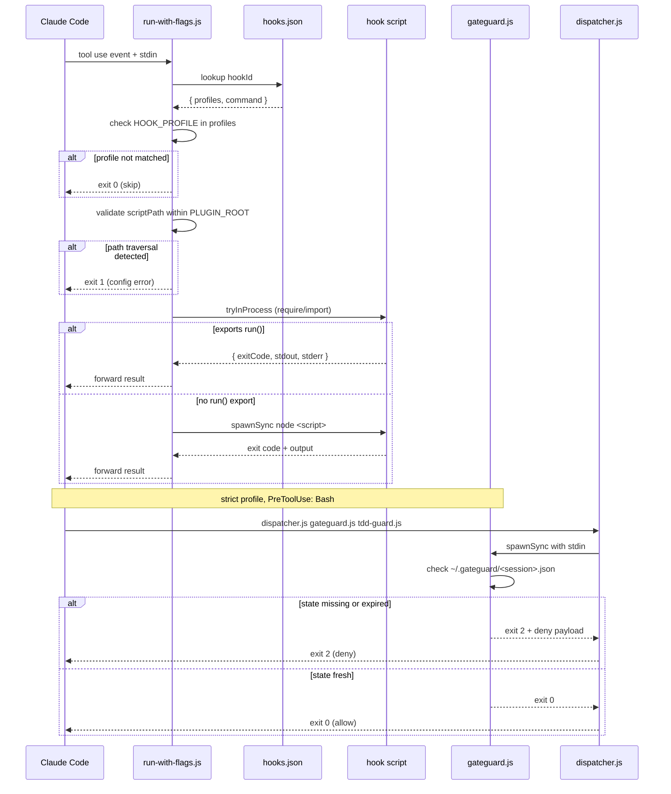

# hook system

## overview

Hooks enforce behavior at the tool layer, not the prompt layer. Every file write, Bash command, and session lifecycle event passes through a registered hook before Claude Code executes it. This makes enforcement unconditional — a hook that denies a write cannot be bypassed by rephrasing a prompt.

The hook pipeline consists of four components working together:

- **`run-with-flags.js`** — profile-gated entry point for every hook invocation
- **`gateguard.js`** — blocks writes until investigation facts are on record
- **`dispatcher.js`** — fans out a single event to multiple sub-hooks
- **`hooks.json`** — registry mapping events to scripts and profiles

---

## profile gating

Three enforcement levels are available. Set the active profile with the `HOOK_PROFILE` environment variable (default: `standard`).

```bash
export HOOK_PROFILE=strict
```

The profile is read at hook execution time, so changing it takes effect immediately without regenerating the plugin.

### hooks by profile

| hook | event | minimal | standard | strict |
|---|---|:---:|:---:|:---:|
| `session-start` | SessionStart (async) | yes | yes | yes |
| `protect-files` | PreToolUse: Edit\|Write | yes | yes | yes |
| `protect-files` | PostToolUse: Edit\|Write | yes | yes | yes |
| `block-main-branch` | PreToolUse: Bash | no | yes | yes |
| `commit-msg-check` | PreToolUse: Bash | no | yes | yes |
| `detect-secrets` | PreToolUse: Edit\|Write | no | yes | yes |
| `detect-secrets` | PostToolUse: Edit\|Write | no | yes | yes |
| `tdd-guard` | PreToolUse: Bash | no | no | yes |
| `gateguard` | PreToolUse: Bash | no | no | yes |

**minimal** — only file protection runs. Suitable for read-heavy workflows or when hooks are applied to an existing project with established conventions.

**standard** — adds branch protection, commit message enforcement, and secret detection. Recommended for active development.

**strict** — adds TDD enforcement and the investigation gate. Use when working on high-risk codebases or when enforcing process rigor matters more than speed.

---

## hook runner (`run-with-flags.js`)

`run-with-flags.js` is the single entry point registered in Claude Code's settings for every hook event. It receives the hook ID and script path as CLI arguments, checks the profile registry, validates the path, and either runs the script in-process or spawns it.

**Usage** (how Claude Code invokes it):
```
node run-with-flags.js <hookId> <scriptPath>
```

### dispatch flow

1. Read `HOOK_PROFILE` (default: `standard`) and `PLUGIN_ROOT` (inferred by walking up to find `hooks/hooks.json` if not set).
2. Load `hooks/hooks.json` and find the entry for `<hookId>`.
3. Check if the current profile is in `hookDef.profiles`. If not, exit 0 (skip silently).
4. Validate that `<scriptPath>` resolves to a path inside `PLUGIN_ROOT`. Reject anything that escapes the root.
5. Read stdin (the tool input JSON from Claude Code).
6. Attempt in-process execution. If the script exports `module.exports.run`, call it directly without spawning a child process.
7. If in-process execution is not supported, spawn `node <scriptPath>` and forward stdin.

### in-process optimization

JS hooks that export a `run` function are executed without spawning a child process:

```js
// Example hook with in-process support
module.exports.run = async ({ stdin, profile, pluginRoot }) => {
  // ... hook logic ...
  return { exitCode: 0, stdout: '', stderr: '' }
}
```

The runner tries CJS `require()` first, then falls back to ESM dynamic `import()`. If neither works, it falls through to `spawnSync`.

### path traversal protection

The resolved absolute path of `<scriptPath>` must start with the resolved `PLUGIN_ROOT`. Any path that tries to escape (e.g., via `../../`) is rejected with exit code 1 before the script is loaded.

### disabling a specific hook

Set `DISABLED_HOOKS` to a comma-separated list of hook IDs. The runner checks this before the profile gate:

```bash
export DISABLED_HOOKS=tdd-guard,commit-msg-check
```

### exit codes

| code | meaning |
|---|---|
| 0 | hook ran and passed, or was skipped for this profile |
| 1 | configuration error (unknown hook ID, path traversal, parse failure) |
| 2 | hook denied the tool use (forwarded to Claude Code) |

---

## gateguard (`gateguard.js`)

GateGuard blocks the first file-write tool use in a session until the agent has presented evidence that it has investigated the codebase. It prevents "write first, read later" patterns that cause regressions.

### what it does

1. Agent attempts a `Write` or `Edit` tool use.
2. GateGuard fires (strict profile only, on PreToolUse: Bash — see hooks.json.j2).
3. If no valid state file exists, exits 2 (deny) with a JSON payload asking the agent to:
   - List every module that imports the target file.
   - Describe the public API surface.
   - Identify data schemas the file owns or depends on.
   - Quote the exact user instruction that prompted the write.
4. Agent reads files and gathers evidence.
5. `gateguard-clear.js` (or `GATEGUARD_CLEAR=1`) writes a state file.
6. Agent retries the write. GateGuard finds a fresh state file and exits 0.

### session state

State files live in `~/.gateguard/` by default (override with `HOOK_STATE_DIR`). Each file is named `<CLAUDE_SESSION_ID>.json` and contains:

```json
{ "clearedAt": 1716000000000 }
```

The gate expires after **30 minutes**. After expiry the gate is active again, requiring a fresh `gateguard-clear` invocation.

State writes are atomic: the file is written to a `.tmp` sibling, then renamed into place to prevent partial reads.

### subagent bypass

When `CLAUDE_SUBAGENT=1`, GateGuard exits 0 immediately. Subagents operate under the oversight of the dispatching agent, which is already gated.

### clearing the gate

```bash
# Via env var (for tests or CI)
GATEGUARD_CLEAR=1 node hooks/gateguard.js

# Via the dedicated helper script
node hooks/gateguard-clear.js

# To reset manually, delete the state file
rm ~/.gateguard/<session-id>.json
```

---

## dispatcher (`dispatcher.js`)

The dispatcher receives multiple sub-hook script paths as CLI arguments, runs each with the same stdin, and aggregates results. It enables a single Claude Code hook registration to invoke multiple scripts.

### usage

```
node dispatcher.js <subHook1> [subHook2] ...
```

### aggregation rules

| sub-hook exit code | dispatcher behavior |
|---|---|
| 0 | pass — continues running remaining hooks |
| 1 | non-fatal error — logs to stderr, continues running remaining hooks |
| 2 | deny — after all hooks complete, forwards the denying hook's stdout and exits 2 |

Failure isolation is the key design property: a broken or erroring sub-hook does not prevent the rest from running. Only an explicit deny (exit 2) blocks the tool use.

The deny payload from the first sub-hook that exited 2 is forwarded on stdout so Claude Code receives the structured deny message.

---

## hook registry (`hooks.json`)

`hooks.json` is the manifest that `run-with-flags.js` reads to determine which hooks are enabled for which profiles. During plugin installation it is also deep-merged with any existing `hooks.json` in the target project.

The file at `hooks.json.j2` is the Jinja2 template rendered during plugin generation. The rendered output is `hooks/hooks.json` in the installed plugin.

### structure

```json
{
  "hooks": [
    {
      "id": "protect-files",
      "event": "PreToolUse",
      "matcher": "Edit|Write",
      "command": "${PLUGIN_ROOT}/hooks/protect-files.js protect-files",
      "profiles": ["minimal", "standard", "strict"]
    }
  ]
}
```

**fields:**

| field | type | required | description |
|---|---|:---:|---|
| `id` | string (`^[a-z0-9-]+$`) | yes | Stable identifier. Used by `DISABLED_HOOKS`. |
| `event` | enum | yes | `SessionStart`, `PreToolUse`, `PostToolUse`, `PreCompact`, `Stop`, `SessionEnd` |
| `matcher` | string | yes | Tool name pattern. Supports `|` alternation (e.g., `Edit\|Write`). Use `*` for all tools. |
| `command` | string | yes | Shell command. `${PLUGIN_ROOT}` is substituted at runtime. |
| `profiles` | string[] | no | Which profiles activate this hook. Omit to run under all profiles. |

### adding a new hook

1. Create the script in `hooks/`.
2. Add an entry to `hooks.json` with a unique `id`.
3. Set `profiles` to the minimum enforcement level that should run it.
4. If the hook should only run under certain tool events, set `matcher` precisely.

```json
{
  "id": "my-new-hook",
  "event": "PreToolUse",
  "matcher": "Bash",
  "command": "${PLUGIN_ROOT}/hooks/my-new-hook.js my-new-hook",
  "profiles": ["strict"]
}
```

### merge behavior during installation

When a plugin is installed into a project that already has a `hooks.json`, the factory uses the `deep_merge` strategy. Array entries are merged by key — existing entries with the same `id` are not clobbered. New entries are appended. This allows multiple plugins to register hooks without overwriting each other.

---

## git-level hooks (`.githooks/`)

The `.githooks/` directory contains standard git hooks that enforce the same commit and secret policies as the Claude Code hooks, but at the git layer. They run for every `git commit` regardless of which tool or editor is used.

### commit-msg

Enforces the `type: [scope] description` commit message format.

**Allowed types:** `feat`, `fix`, `docs`, `refactor`, `test`, `perf`, `build`, `ci`, `chore`

**Breaking change format:** `feat!: [scope] description`

**Passes through:** Merge commits (`^Merge `) and revert commits (`^Revert `) are skipped without validation.

**Blocks AI attribution:** Any commit message containing `claude`, `anthropic`, `copilot`, `gpt`, `openai`, `cursor`, or `gemini` (case-insensitive) is rejected.

**Note:** Use `type: [scope] description` — do NOT use `type(scope):` format. The parenthesis form breaks semantic-release.

### pre-commit

Scans all staged files before a commit is created.

| Check | Pattern | Behavior |
|---|---|---|
| Secret detection | `sk-*`, `AKIA*`, `ghp_*`, `glpat-*` | Blocks commit if found in any staged file |
| Env file protection | `.env`, `.env.*`, `*.env.local` | Blocks commit if an env file is staged |
| JSON validation | `*.json` | Blocks commit if any staged JSON file fails to parse |
| Debug statements | `debugger`, `console.debug` in `*.js`/`*.mjs` | Blocks commit if found |

### activation

```bash
git config core.hooksPath .githooks
```

This is a per-repository setting. It tells git to look for hooks in `.githooks/` instead of the default `.git/hooks/`. Run once after cloning.

### relationship to Claude Code hooks

The Claude Code `commit-msg-check` and `detect-secrets` hooks enforce the same rules during Claude Code sessions. The `.githooks/` hooks provide a second enforcement layer that catches violations from any git client — terminal, IDE, GUI, or CI.

---

## hook execution flow


