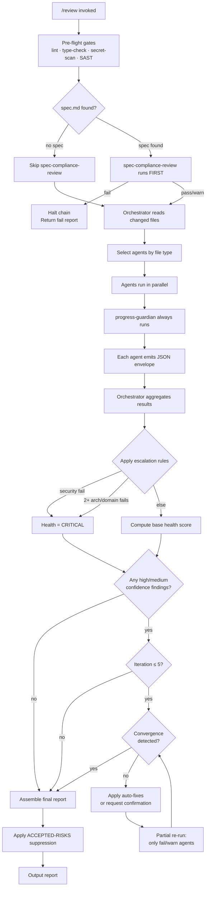

# Review Pipeline

The `/review` command (or `/code-review`) triggers a multi-agent pipeline that runs pre-flight gates, dispatches specialist agents in parallel, scores health, applies auto-fixes, and emits a structured report.

---

## Pipeline Overview

```
/review invoked
     │
     ▼
Pre-flight gates (lint, type-check, secret-scan, SAST)
     │
     ▼
Orchestrator reads changed files → selects agents by file type
     │
     ▼
Agents run in parallel → each emits JSON envelope
     │
     ▼
Orchestrator aggregates → applies escalation rules → computes health score
     │
     ▼
Confidence-gated auto-fix loop (max 5 iterations)
     │
     ▼
Report assembled → ACCEPTED-RISKS suppression applied → output
```

---

## Pre-Flight Gates

Gates run before any agent is invoked. A gate failure surfaces prominently in the report but does **not** block agents.

| Gate | Tools | Pass | Fail | Not configured |
|---|---|---|---|---|
| Lint | eslint / ruff / golangci-lint | ✅ | ❌ | ➖ |
| Type Check | tsc / mypy / go vet | ✅ | ❌ | ➖ |
| Secret Scan | gitleaks / trufflehog | ✅ | ❌ | ➖ |
| SAST | semgrep | ✅ | ❌ | ➖ |

Gate failures are reported in their own section at the top of the review report.

---

## Agent Dispatch

The orchestrator reads the list of changed files and selects agents based on file category. All selected agents run in parallel.

### File-type to agent dispatch

| File category | Agents dispatched |
|---|---|
| Any code file | complexity-review, naming-review, performance-review |
| Code with tests | test-review |
| Code with async / concurrency | concurrency-review |
| Code with domain models | domain-review |
| Code touching structure / layout | structure-review |
| Security-sensitive paths | security-review |
| Documentation / comments | doc-review |
| All runs | progress-guardian (always), spec-compliance-review (always, first gate) |

`spec-compliance-review` runs first. If the spec gate fails, the orchestrator halts the chain and returns `fail` without running remaining agents.

`progress-guardian` is never skipped regardless of file type.

### Step complexity routing

| Complexity | Trigger | Model override |
|---|---|---|
| trivial | Single-file change, no logic | Haiku for all agents |
| standard | Default | Per-agent assignment |
| complex | Cross-cutting change, >5 files, or domain-heavy | Sonnet/Opus promoted |

---

## JSON Output Envelope

Every agent emits one JSON object conforming to `schemas/review-output.schema.json`.

```json
{
  "status": "pass | warn | fail | skip",
  "issues": [
    {
      "severity": "error | warning | suggestion",
      "confidence": "high | medium | none",
      "file": "repo-relative/posix/path",
      "line": 42,
      "message": "description of issue",
      "suggestedFix": "concrete remediation"
    }
  ],
  "summary": "one-line summary"
}
```

**Field rules:**
- `file`: repo-relative POSIX path, no leading slash
- `line`: 1-indexed; `null` only when the issue spans the entire file
- `issues`: empty array when `status` is `pass` or `skip`
- The orchestrator rejects envelopes with missing or unrecognized `confidence` values as schema errors

---

## Orchestrator Aggregation

After all agents complete, the orchestrator aggregates into `schemas/orchestrator-aggregation.schema.json`.

```json
{
  "healthScore": "HEALTHY | NEEDS_ATTENTION | CRITICAL",
  "agentResults": [
    { "agent": "security-review", "status": "fail", "issueCount": 2 }
  ],
  "summary": "top 3 priorities synthesized across all findings"
}
```

---

## Health Scoring

| Score | Condition |
|---|---|
| HEALTHY | 0 fail AND ≤2 warn across all agents |
| NEEDS_ATTENTION | 1–2 fail OR 3+ warn across all agents |
| CRITICAL | 3+ fail OR any `security-review` fail |

A single fail combined with 3+ warn scores NEEDS_ATTENTION, not CRITICAL, unless an escalation rule applies.

### Escalation rules

| Rule | Trigger | Override |
|---|---|---|
| Security escalation | Any `security-review` fail | → CRITICAL (always) |
| Architecture escalation | 2+ fails from `arch-review` or `domain-review` combined | → CRITICAL |

One architecture fail alone does not escalate. Two or more signals systemic design breakdown.

All agent tiers (Haiku / Sonnet / Opus) carry equal weight toward the health score.

---

## Confidence-Gated Auto-Fix

Each finding's `confidence` value determines what the orchestrator may do without user intervention.

| Confidence | Action |
|---|---|
| `high` | Auto-fix applied immediately. Change staged. Noted in report. |
| `medium` | Diff presented. User must approve before fix is applied. |
| `none` | Report only. No fix attempted. |

---

## Review-Fix Loop

After the initial review, the orchestrator enters a fix loop for any auto-fixable or confirmed-fix findings.

**Rules:**

1. **Max iterations**: 5. If fixable findings remain after iteration 5, the loop exits. Remaining findings are reported as unresolved.

2. **Convergence detection**: Before each iteration, the orchestrator compares the current finding set to the previous one. If the same issues (same agent + file + line) persist across two consecutive iterations, the loop exits early. Repeating the same fix without improvement is a loop failure, not progress.

3. **Partial re-run**: On iterations 2–5, only agents that emitted at least one `fail` or `warn` in the prior iteration are re-run. All-pass agents are skipped, reducing latency and token cost.

```
Iteration 1: all selected agents run
Iteration 2+: only agents with prior fail/warn re-run
Exit when: all fixable findings resolved, convergence detected, or iteration 5 complete
```

---

## Plan Review

When the target is a plan document (not code), the orchestrator dispatches 4 reviewer personas in parallel instead of the code-review agents.

| Persona | Role |
|---|---|
| plan-review-strategic | Scope, problem-fit, reversibility, root cause vs symptom |
| plan-review-design | Circular deps, SRP, God objects, architecture quality |
| plan-review-acceptance | AC verifiability, independence, test ordering, error paths |
| plan-review-ux | Error recovery, destructive confirmations, keyboard nav, cognitive load |

**3-warning rule**: If 3 or more warnings accumulate across all 4 personas, the plan receives `needs-revision` status. Execution is blocked. The plan author must address warnings and resubmit.

`plan-review-ux` is the only persona with self-skip logic. It returns `approve` with `skipped: true` when no UI-facing user stories are detected.

---

## ACCEPTED-RISKS Suppression

Findings can be suppressed by adding entries to `ACCEPTED-RISKS.md` at the repo root. Suppressed findings are never silently dropped — they appear in their own report section but do not contribute to fail/warn counts and do not affect the health score.

**Suppression entry format:**

```markdown
| rule-id | path/to/file.ts:10 | Short description | @engineer | 2026-12-31 |
```

An entry with a past expiry date is treated as if it does not exist. The finding is re-surfaced and counted normally.

---

## Report Format

The assembled report follows the structure from `templates/knowledge/review-template.md`.

### Sections in order

**1. Pre-Flight Gates**
Table of gate results (✅ / ❌ / ➖).

**2. Agent Results**

| Agent | Model Tier | Status | Issues |
|---|---|---|---|
| spec-compliance-review | sonnet | pass / warn / fail / skip | n |
| security-review | opus | pass / warn / fail / skip | n |
| ... | ... | ... | ... |

**3. Health Score**

```
HEALTH: HEALTHY | NEEDS_ATTENTION | CRITICAL
```

**4. Findings** (grouped by severity, descending)

```
[agent-name] path/to/file.ts:42
Message: <description>
Fix:     <remediation>
Confidence: high | medium | none
```

Order: error → warning → suggestion. Within each group: sorted by agent name, then file path. Suggestions never contribute to fail counts.

**5. Recommendations**
Top 3 priorities synthesized across all findings. Cross-agent recurrence (same root cause flagged by multiple agents) ranks higher.

**6. Suppressed by ACCEPTED-RISKS**
Table of suppressed findings with rule ID, file, message, owner, and expiry. If none: "No findings suppressed in this run."

**7. Statistics**

```
Total issues:            <n>
  Auto-fixable:          <n>  (high confidence — applied)
  Needs confirmation:    <n>  (medium confidence — awaiting approval)
  Report only:           <n>  (none confidence — no fix attempted)
Suppressed:              <n>
```

Counts reflect post-suppression, post-loop state.

---

## Full Pipeline Mermaid Diagram


